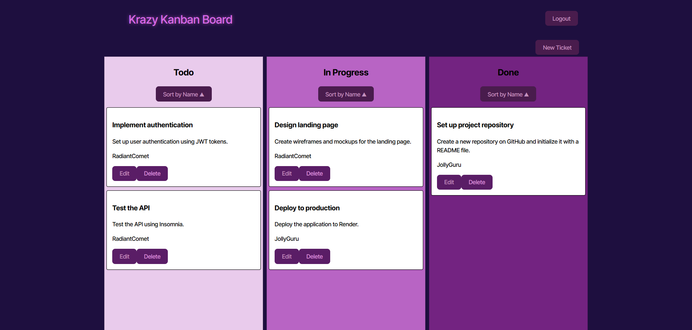

# Kanban-Board

[](https://mit-license.org/)

## Description
        
A Kanban board application with JWT authentication login, that allows you to create, edit, and delete tickets on the board.


        
## Table of Contents

* [Installation](#installation)
* [Usage](#usage)
* [Questions](#questions)
* [License](#license)
        
## Installation
        
> To install dependecies
```
npm i
```

> To run the application
```
npm run start
```
        
## Usage
        
To use this application, login by clicking the button in the top right, and enter valid username and password. To create a new ticket or edit a previous ticket, click the new ticket button or edit button, and fill out or change the form. To delete a ticket, simply click the delete button. To return back to the board at any time, click the Krazy Kanban Board at the top left. If your session expires, which is set for 5 minutes, when you try to click on any link or button, you will be redirected to the login page.

See the [Deployed Application](https://candidate-search-1-e5x6.onrender.com/)

## Questions

[My GitHUb profile](https://github.com/JamixB97)

For additional questions email me at bamesb@gmail.com 

## License
    
This project is licensed under the MIT License - see the [License](https://mit-license.org/) file for details.
